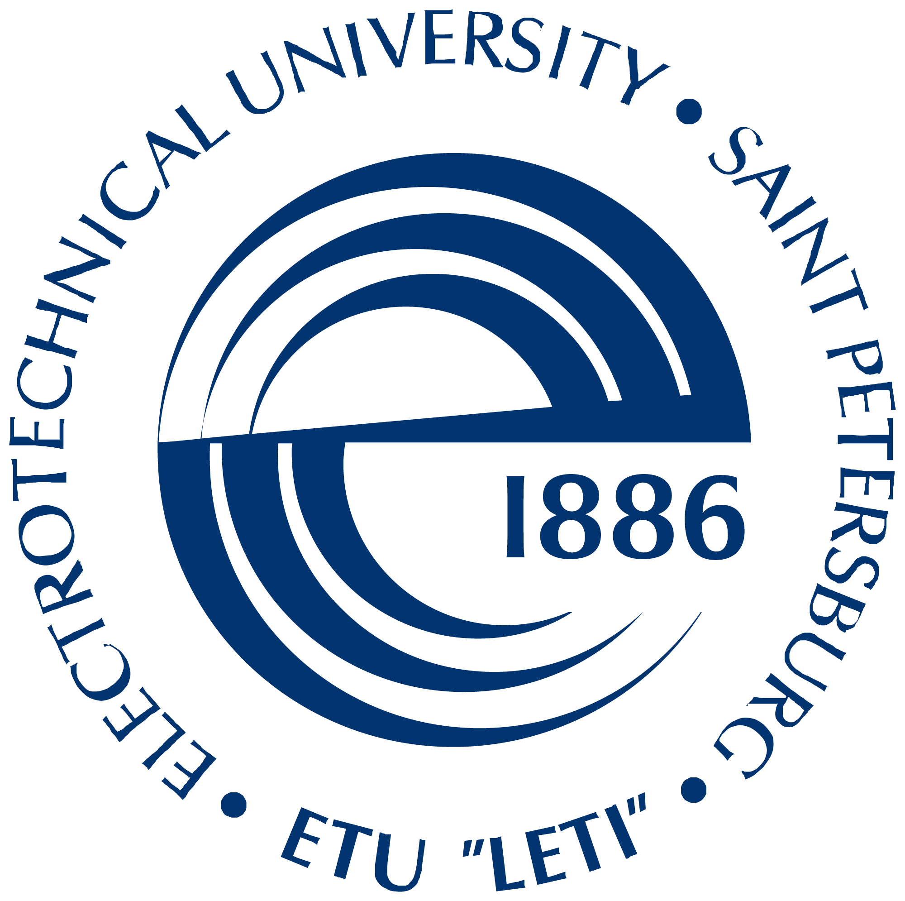

### :raised_hand: Здравствуйте! Меня зовут Анатолий Слабоденюк и я инженер по тестированию. Общий стаж работы - с сентября 2022 года

<!--
**AnatolySlabodenyuk/AnatolySlabodenyuk** is a ✨ _special_ ✨ repository because its `README.md` (this file) appears on your GitHub profile.

Here are some ideas to get you started:

- 🔭 I’m currently working on ...
- 🌱 I’m currently learning ...
- 👯 I’m looking to collaborate on ...
- 🤔 I’m looking for help with ...
- 💬 Ask me about ...
- 📫 How to reach me: ...
- 😄 Pronouns: ...
- ⚡ Fun fact: ...
-->

<table width="100%" border='0'>
   <tr> 
    <td width="30%" valign="bottom"></td><td valign="middle">Санкт-Петербургский государственный электротехнический университет «ЛЭТИ». Факультет радиотехники. Инженер.</td></tr>
    <tr><td width="30%" valign="bottom"></td><td valign="middle"><a target="_blank" href="https://qa.guru">Яндекс Практикум</a> Курс "Инженер по тестированию".</td>
    <tr><td width="30%" valign="bottom"></td><td valign="middle">Школа инженеров по автоматизации тестирования <a target="_blank" href="https://qa.guru">qa.guru</a>.</td></tr>
   </tr>
  </table>
   

